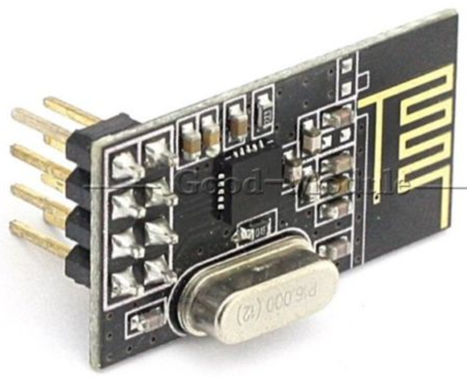
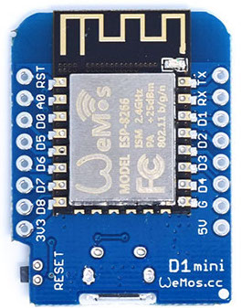
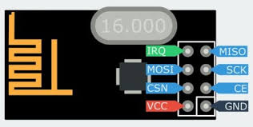
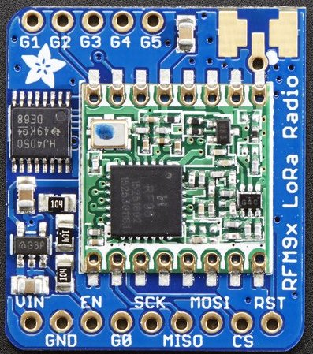

# d1miniradiohead

Tests of two radio modules. I two sets of Wemos d1 min - radio to be able to test communication between them.

- Radio modules
  - Adafruit	RFM95W LoRa Radio Transceiver - https://www.adafruit.com/product/3072
  - nrf24l01+ - http://www.ebay.com/itm/2pcs-NRF24L01-2-4GHz-Antenna-Wireless-Transceiver-Module-Microcontrol-/251044600998
- Controlled by wemos d1 mini - https://www.wemos.cc/product/d1-mini.html
- Software driver: Radiohead - http://www.airspayce.com/mikem/arduino/RadioHead/index.html
- software development environment: PlatformIO in Atom editor

## 2.4GHz radio nRF24l01+



### Wiring




Wemos d1 mini | nRF24l01+
--- | ---
3v3 | VCC
G | GND
D8 | CSN
D7 | MOSI
D6 | MISO
D5 | CLK
D2 | CE
-- | IRQ

### Software

I started with
-  http://www.airspayce.com/mikem/arduino/RadioHead/nrf24_reliable_datagram_client_8pde-example.html
-  http://www.airspayce.com/mikem/arduino/RadioHead/nrf24_reliable_datagram_server_8pde-example.html.

In both programs I specified my pin assigments for EN and CSN by replacing the row

`RH_NRF24 driver;`

with

`RH_NRF24 driver(D2, D8);`

resulting in the project folders nrf24rx and nrf24tx.

- Install PlatformIO
- clone this repo
- open nrf24tx and nrf24rx in PlatformIO
- Upload to each d1 mini - radio set
- Connect the nrf24rx set to your PC, open a serial monitor and reset it. It should not say init failed.
- Connect the nrf24rx set to a power supply
- Connect the nrf24tx to your PC, and open a serial monitor and reset to see that it initilizes correctly
- Now you should see something like this:

```
➜  nrf24rx git:(master) pio -f -c atom serialports monitor --port /dev/cu.wchusbserial1410
--- Miniterm on /dev/cu.wchusbserial1410  115200,8,N,1 ---
--- Quit: Ctrl+C | Menu: Ctrl+T | Help: Ctrl+T followed by Ctrl+H ---
Sending to nrf24_reliable_datagram_server
got reply from : 0x2: And hello back to you
Sending to nrf24_reliable_datagram_server
got reply from : 0x2: And hello back to you
...
```

## 868MHz Lora radio RFM95W




### Wiring

Wemos d1 mini | RFM95W
--- | ---
3v3 | Vin
G | GND
D8 | CS
D7 | MOSI
D6 | MISO
D5 | SCK
D2 | G0 (IRQ)
-- | EN not connected makes it enabled


### Software

I started with
- http://www.airspayce.com/mikem/arduino/RadioHead/rf95_reliable_datagram_client_8pde-example.html
- http://www.airspayce.com/mikem/arduino/RadioHead/rf95_reliable_datagram_server_8pde-example.html.

In this case I changed two lines in both programs:

`RH_RF95 driver;`

with

`RH_RF95 driver(D8, D2);`

and as I live in Sweden I added the following line to set the allowed frequency:

`driver.setFrequency(868.0);`

resulting in the project folders lorarx and loratx.
